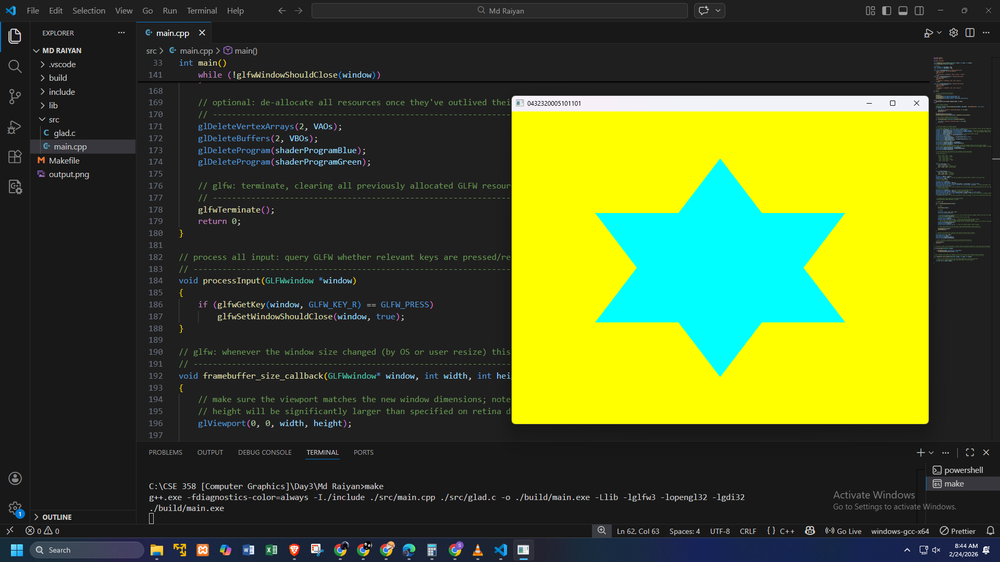

# ⭐ Lab 03: Drawing a Cyan Star Using OpenGL

## 📋 Description
This OpenGL application renders **one cyan-colored star** constructed **entirely using triangles** on a **yellow background**. The program demonstrates the use of **Modern OpenGL (Core Profile)** concepts such as vertex buffers, vertex arrays, and shader programs. The window displays the student’s information as the title and follows proper rendering and input-handling practices.

---

## ✅ Requirements Fulfilled
- Created a dedicated GitHub repository for the CGM course  
- Yellow background window  
- One cyan-colored star built **only using triangles**  
- Star rendered using `glDrawArrays(GL_TRIANGLES)`  
- Vertex Array Object (VAO) and Vertex Buffer Object (VBO) used  
- Modern OpenGL **Core Profile (3.3)** followed  
- Proper code structure, formatting, and comments  
- Original work implemented and tested locally  
- README documentation included  
- Output screenshot attached  

---

## 🔧 Program Features
- **Graphics API:** OpenGL 3.3 Core Profile  
- **Window Management:** GLFW  
- **Function Loader:** GLAD  
- **Primitive Used:** Triangles only  

---

## 🪟 Window Properties
- **Resolution:** 800 × 600 pixels  
- **Background Color:** Yellow `(1.0, 1.0, 0.0)`  
- **Window Title:** Student Information  

---

## 🎨 Rendering Details
- One **cyan-colored star**
- Star shape constructed exclusively from **multiple triangles**
- All triangle vertices are defined manually
- Rendering performed using:
  - Vertex Buffer Object (VBO)
  - Vertex Array Object (VAO)
- Fragment shader outputs cyan color `(0.0, 1.0, 1.0, 1.0)`

---

## ⌨️ Keyboard Interaction
- Keyboard input handled using GLFW  
- Turns the window off by pressing "**R**"  

---

## 🧪 Technologies Used
- **C++**
- **OpenGL**
- **GLFW**
- **GLAD**

---

## 📸 Output Screenshot

---

## 🧑‍🎓 Author
**Md Raiyan**  
ID – 0432320005101101  

---

## 📝 Notes
- The star is composed strictly of triangles to meet assignment constraints  
- Modern OpenGL pipeline is followed (no deprecated functions)  
- Project is intended for **academic and learning purposes**

---
