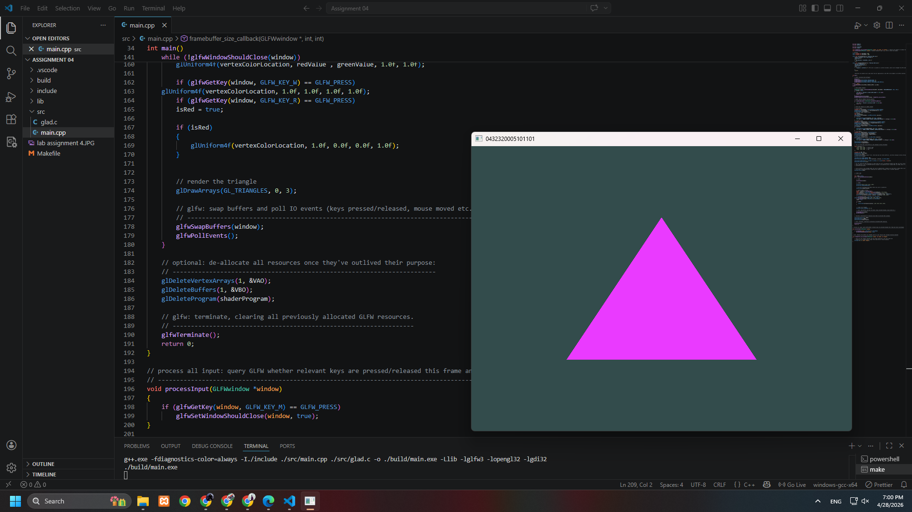

# ⭐ Lab 04: Dynamic Color Triangle Using OpenGL

## 📋 Description
This OpenGL application renders **one triangle** whose color changes dynamically over time using shader uniforms. The triangle initially appears in **cyan** and smoothly transitions between **cyan and magenta** during execution. The program demonstrates the use of **Modern OpenGL (Core Profile)** concepts such as vertex buffers, vertex arrays, shader programs, and uniform variables. Keyboard input is also implemented to interact with the triangle color and close the window.

---

## ✅ Requirements Fulfilled
- Created a dedicated GitHub repository for the CGM course  
- Window with custom background color  
- One triangle rendered using `glDrawArrays(GL_TRIANGLES)`  
- Triangle color changes dynamically over time  
- Triangle transitions between **cyan and magenta**  
- Keyboard interaction implemented using GLFW  
- Vertex Array Object (VAO) and Vertex Buffer Object (VBO) used  
- Modern OpenGL **Core Profile (3.3)** followed  
- Proper code structure, formatting, and comments  
- Original work implemented and tested locally  
- README documentation included  

---

## 🔧 Program Features
- **Graphics API:** OpenGL 3.3 Core Profile  
- **Window Management:** GLFW  
- **Function Loader:** GLAD  
- **Primitive Used:** Triangle  

---

## 🪟 Window Properties
- **Resolution:** 800 × 600 pixels  
- **Background Color:** Dark Teal `(0.2, 0.3, 0.3)`  
- **Window Title:** 0432320005101101  

---

## 🎨 Rendering Details
- One triangle rendered at the center of the window  
- Triangle vertices defined manually  
- Rendering performed using:
  - Vertex Buffer Object (VBO)
  - Vertex Array Object (VAO)
- Fragment shader uses a **uniform variable** to control color  
- Triangle initially starts as **cyan** `(0.0, 1.0, 1.0)`  
- Triangle smoothly changes color between:
  - **Cyan** `(0.0, 1.0, 1.0)`
  - **Magenta** `(1.0, 0.0, 1.0)`
- Color animation created using:
  - `sin(time)` for Red channel  
  - `cos(time)` for Green channel  

---

## ⌨️ Keyboard Interaction
- Keyboard input handled using GLFW  

| Key | Action |
|-----|--------|
| **W** | Turns triangle white while pressed |
| **R** | Turns triangle permanently red |
| **M** | Closes the window |

---

## 🧪 Technologies Used
- **C++**
- **OpenGL**
- **GLFW**
- **GLAD**

---

## 📸 Output Screenshot

---

## 🧑‍🎓 Author
**Md Raiyan**  
ID – 0432320005101101  

---

## 📝 Notes
- The triangle is rendered using the Modern OpenGL pipeline  
- Shader uniforms are used for real-time color updates  
- Color animation transitions smoothly from cyan to magenta  
- No deprecated OpenGL functions are used  
- Project is intended for **academic and learning purposes**  

---
